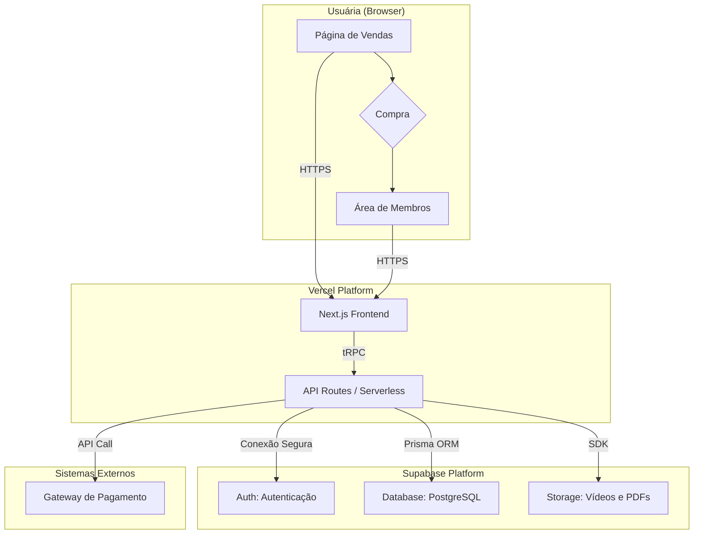
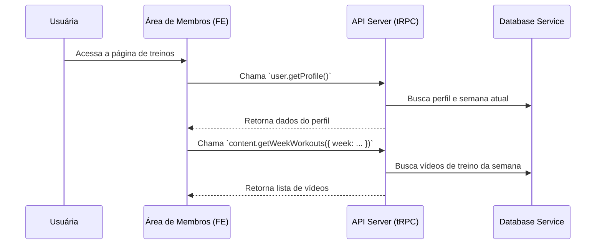

# Renova 30 Fullstack Architecture Document

## 1. Introduction

Este documento descreve a arquitetura full-stack completa para o projeto **Renova 30**. Ele serve como a única fonte da verdade para o desenvolvimento, garantindo consistência em toda a pilha de tecnologia, do backend ao frontend.

### 1.1. Ponto de Partida

O "Renova 30" é um projeto *Greenfield* (iniciado do zero). Para acelerar o desenvolvimento com boas práticas, a arquitetura será baseada no template de monorepo **T3 Stack**. Ele combina Next.js (React), TypeScript, tRPC (para APIs seguras), Prisma (para o banco de dados) e Tailwind CSS, o que é ideal para uma aplicação web moderna com área de membros.

### 1.2. Histórico de Alterações

| Data | Versão | Descrição | Autor |
| :--- | :--- | :--- | :--- |
| 2026-02-25 | 1.0 | Versão inicial do documento de arquitetura. | Aria (@architect) |

---

## 2. Arquitetura de Alto Nível

Esta seção estabelece a fundação técnica do projeto "Renova 30".

### 2.1. Resumo Técnico

A arquitetura para o "Renova 30" será um **monorepo full-stack typesafe**, implantado na **Vercel** com um banco de dados **Supabase (PostgreSQL)**. O frontend será uma aplicação Next.js (React) com páginas estáticas para a landing page e páginas dinâmicas para a área de membros. O backend será uma combinação de rotas de API do Next.js e funções serverless, comunicando-se de forma segura com o frontend via tRPC.

### 2.2. Plataforma e Infraestrutura

-   **Plataforma:** Vercel + Supabase
-   **Serviços Chave:** Vercel (Hospedagem, API Serverless, CI/CD), Supabase (Banco de Dados, Autenticação, Armazenamento de arquivos).
-   **Região de Deploy:** `sa-east-1` (São Paulo) para baixa latência no Brasil.

### 2.3. Estrutura do Repositório

-   **Estrutura:** Monorepo com **Turborepo**.
-   **Organização:** Código da aplicação em `apps/web`, schema do banco em `packages/db`, e componentes de UI compartilhados em `packages/ui`.

### 2.4. Diagrama da Arquitetura



### 2.5. Padrões Arquiteturais

-   **Jamstack:** O site de vendas será pré-renderizado para máxima performance.
-   **Serverless-First:** Backend em funções serverless que escalam sob demanda.
-   **Monorepo com Code Sharing:** Compartilhamento de tipos e lógica entre front e back.

---

## 3. Pilha de Tecnologias (Tech Stack)

| Categoria | Tecnologia | Versão |
| :--- | :--- | :--- |
| Linguagem | TypeScript | latest |
| Framework Frontend | Next.js (React) | latest |
| Framework Backend | Next.js API Routes | latest |
| Estilo de API | tRPC | latest |
| Banco de Dados | Supabase (PostgreSQL) | latest |
| ORM | Prisma | latest |
| Autenticação | Supabase Auth | latest |
| Armazenamento | Supabase Storage | latest |
| UI | shadcn/ui + Tailwind | latest |
| Testes | Vitest + Playwright | latest |
| Build | Turborepo | latest |
| Deploy | Vercel | latest |

---

## 4. Modelos de Dados

- **`User` (Usuária - Autenticação):** Gerenciado pelo Supabase Auth (`id`, `email`). Relaciona-se 1-para-1 com `UserProfile`.
- **`UserProfile` (Perfil da Usuária - Dados da App):** Armazena dados da aplicação (`id`, `full_name`, `quiz_answers`, `current_week`).
- **`Workout` (Treino):** Um único vídeo de treino (`id`, `title`, `video_url`, `level`, `focus`).
- **`ProgramWeek` (Semana do Programa):** Agrupa treinos para uma semana (`id`, `week_number`, `title`). Relaciona-se N-para-N com `Workout`.
- **`Bonus`:** Um material bônus (`id`, `title`, `file_url`, `type`).

---

## 5. Especificação da API (tRPC)

A API será estruturada em roteadores lógicos usando tRPC.

```typescript
// Roteador principal da aplicação: src/server/api/root.ts
export const appRouter = t.router({
  auth: authRouter, // Procedimentos de autenticação (ex: getSession)
  user: userRouter, // Procedimentos do usuário (ex: getProfile, updateWeekProgress)
  content: contentRouter, // Procedimentos do conteúdo (ex: getWeekWorkouts, getBonuses)
});

export type AppRouter = typeof appRouter;
```

---

## 6. Componentes Principais

- **`Sales Page` (Frontend):** Apresenta e vende o produto.
- **`Members Area` (Frontend):** A experiência logada da aluna.
- **`API Server` (Backend):** Orquestra a lógica de negócio via tRPC.
- **`Auth Service` (Serviço de Backend):** Abstrai a lógica de autenticação do Supabase.
- **`Database Service` (Serviço de Backend):** Abstrai o acesso ao banco de dados com Prisma.

---

## 7. Fluxos de Trabalho Principais



---

## 8. Schema do Banco de Dados

Schema inicial em SQL para o PostgreSQL, gerenciado pelo Prisma.

```sql
-- Tabela de perfis, estendendo os usuários do Supabase Auth
CREATE TABLE "UserProfile" (
  "id" UUID NOT NULL PRIMARY KEY REFERENCES auth.users(id),
  "full_name" TEXT,
  "quiz_answers" JSONB,
  "current_week" INTEGER NOT NULL DEFAULT 1,
  "updated_at" TIMESTAMP WITH TIME ZONE DEFAULT timezone('utc'::text, now()) NOT NULL
);

-- Tabela de treinos individuais
CREATE TABLE "Workout" (
  "id" UUID NOT NULL PRIMARY KEY DEFAULT gen_random_uuid(),
  "title" TEXT NOT NULL,
  "video_url" TEXT NOT NULL,
  "level" TEXT NOT NULL, -- "Iniciante", "Intermediário", "Avançado"
  "focus" TEXT NOT NULL  -- "Barriga Plana", etc.
);

-- Tabela das semanas do programa
CREATE TABLE "ProgramWeek" (
  "id" UUID NOT NULL PRIMARY KEY DEFAULT gen_random_uuid(),
  "week_number" INTEGER NOT NULL UNIQUE,
  "title" TEXT NOT NULL,
  "description" TEXT
);

-- Tabela de junção para o relacionamento N-N entre semanas e treinos
CREATE TABLE "_ProgramWeekToWorkout" (
  "A" UUID NOT NULL REFERENCES "ProgramWeek"(id) ON DELETE CASCADE,
  "B" UUID NOT NULL REFERENCES "Workout"(id) ON DELETE CASCADE
);
CREATE UNIQUE INDEX "_ProgramWeekToWorkout_AB_unique" ON "_ProgramWeekToWorkout"("A", "B");
CREATE INDEX "_ProgramWeekToWorkout_B_index" ON "_ProgramwWeekToWorkout"("B");

-- Tabela de materiais bônus
CREATE TABLE "Bonus" (
  "id" UUID NOT NULL PRIMARY KEY DEFAULT gen_random_uuid(),
  "title" TEXT NOT NULL,
  "description" TEXT,
  "file_url" TEXT NOT NULL,
  "type" TEXT NOT NULL -- "PDF", "Audio"
);
```

---

## 9. Estrutura Unificada do Projeto (Monorepo)

```
/
├── apps/
│   └── web/                # Aplicação Next.js (Frontend + Backend tRPC)
├── packages/
│   ├── db/                 # Schema e cliente Prisma
│   ├── ui/                 # Componentes React compartilhados (shadcn/ui)
│   └── config/             # Configurações de ESLint, TypeScript
├── package.json            # Raiz do Monorepo
└── .env.example
```

---

## 10. Estratégia de Testes

A estratégia seguirá a pirâmide de testes:
- **Testes Unitários (Base):** `Vitest` será usado para testar funções, hooks e componentes de UI isoladamente, tanto no frontend quanto no backend.
- **Testes de Integração (Meio):** `Vitest` também será usado para testar a integração entre os procedimentos tRPC e o serviço de banco de dados, garantindo que a lógica de negócio funcione de ponta a ponta no backend.
- **Testes de Ponta-a-Ponta (Topo):** `Playwright` será usado para simular a jornada completa da usuária no browser, desde a compra até assistir a um vídeo, garantindo que todos os componentes integrados funcionem como esperado.

---

## 11. Implantação (Deployment) e CI/CD

- **Plataforma:** Vercel.
- **Estratégia de CI/CD:** A Vercel se integrará diretamente ao repositório Git (GitHub).
- **Fluxo:**
    1.  Um `git push` para a branch `main` irá acionar um build de produção automaticamente.
    2.  Um `git push` para qualquer outra branch (ex: `feature/nova-funcionalidade`) irá gerar uma "Preview URL" isolada para testes antes do merge.
- **Build Command:** `turbo run build` (Comando do Turborepo que construirá as aplicações e pacotes necessários).

---

## 12. Segurança e Performance

- **Segurança:**
    - **Autenticação:** Gerenciada pelo Supabase Auth (JWTs).
    - **Autorização:** Políticas de segurança a nível de linha (RLS) no Supabase serão ativadas para garantir que uma usuária só possa ver e modificar seus próprios dados (`UserProfile`, progresso, etc.).
    - **Variáveis de Ambiente:** Todas as chaves secretas (Supabase keys, etc.) serão gerenciadas via variáveis de ambiente, nunca hard-coded.
- **Performance:**
    - **Frontend:** A Página de Vendas será gerada estaticamente (SSG) para carregamento instantâneo. A Área de Membros usará uma mistura de renderização no servidor (SSR) e no cliente (CSR) para um bom equilíbrio entre performance e interatividade.
    - **Backend:** As APIs Serverless da Vercel escalam sob demanda.
    - **Imagens e Vídeos:** Serão servidos por CDNs (Vercel e Supabase Storage) para entrega rápida global.

---

## 13. Resultados do Checklist de Arquitetura

*Esta seção será preenchida após a execução da tarefa de validação (`*execute-checklist architect-checklist`)*.
- **Status:** Pendente.
